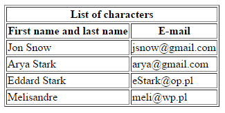
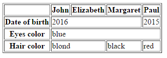

# HTML &ndash; tables

1. In **index.html** create a following table:

   

1. In **index.html** create a following table:

   

## Important

* In the CSS file there is a style that will give the tables an appropriate border. You only need to link the stylesheet to your HTML page, just like you did in other exercises.
* Remember about the **scope** attribute in both tables.
* Do not use tags that format the text, such as **b** or **strong**.
* Remember about headers &ndash; both horizontal and vertical.

## Need help or inspiration?
* [colspan and rowspan](https://jsfiddle.net/barney/ZBC6d/)
* [Documentation, tables](https://developer.mozilla.org/en-US/docs/Learn/CSS/Styling_boxes/Styling_tables)
* [w3.org, scope attribute](https://www.w3.org/TR/WCAG20-TECHS/H63.html)
* HTML and CSS &ndash; prework
