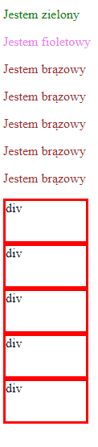

# HTML &ndash; document styling

 Follow the instructions below. After each of them, do the following:
    * save changes and refresh the browser,
    * place a comment with a description of what has changed and why.

Have you noticed any rules in the way that CSS works?

#### 1. EXTERNAL STYLE SHEET, blue background
In **css** catalog create a **style.css** file. In this file, set a blue background for the **body**.

#### 2. INTERNAL STYLE SHEET, pink background
Add internal styles to the **head** section of the **html** file. There you should set a pink background for the **body**.

#### 3. INLINE STYLE, green background
In the **html** file, add **style** attribute to the **body** tag. Set the background to green.

---

## class and id
The purpose of the following exercises is to properly use element, class and id selectors. Follow the instructions below and use all three types of selectors.

1. Create five paragraphs. Set brown font color for all of them.

2. Create two more paragraphs and give each an appropriate ```id```:
* the first with green font color and ```id="first-paragraph"```,
* the second with violet font color and ```id="second-paragraph"```.

3. Create five **div** elements with the class: ```block```. They should have the following properties:
    * width: 100px,
    * height: 50px,
    * border thickness: 3px,
    * border style: a single continuous line (solid),
    * border color: red.


The effect should be similar to the example below:

  


## Need help or inspiration?
* [w3schools, element selector](https://www.w3schools.com/cssref/sel_element.asp)
* [w3schools, class selector](https://www.w3schools.com/cssref/sel_class.asp)
* [Documentation, id selector](https://developer.mozilla.org/en-US/docs/Web/CSS/ID_selectors),
* [Documentation, border property](https://developer.mozilla.org/en-US/docs/Web/CSS/border),
* HTML and CSS &ndash; prework
