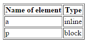

## Box model
1. In the **index.html** file create a link (element a) to a programming website of your choice. Give it the **link** class. In the **style.css** file give the link the following styles:
  * color: red;
  * border: 1px solid red;
  * width: 500px;

  **Remember to add style.css to index.html**. What happened? Is your link 500px wide? What type of an element is a link: inline or block? Describe your observations in a comment in the HTML file.

2. In the **index.html** file add a new element &ndash; **p**. Set the same styles for this paragraph as you did for the link above. What is happening this time? What type of an element is a paragraph? Describe your observations in a comment in the HTML file.

3. Check, what types of the following elements are:

    * a
    * p
    * h1
    * h2
    * h3
    * div
    * span
    * em
    * strong
    * u
    * ul
    * ol
    * table
    * img
    * iframe

Create a table listing all the abovementioned HTML elements along with their type. Each element must be located in a different cell. Fill the table as shown below:

 

## Need help or inspiration?

* [Inline vs block, short video tutorial](https://www.youtube.com/watch?v=bOh9WjucNsA)
* HTML and CSS &ndash; prework
