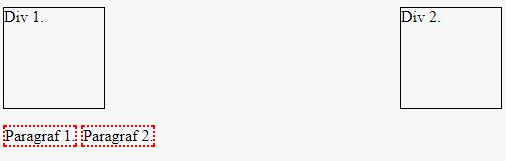

# HTML/CSS &ndash; elements side by side


Create a style.css file. Remember to add it to the index.html. Write CSS styles in style.css.

Arrange elements according to the following scheme:



##### 1. Give the elements appropriate attributes:
  * the first div - 'Div 1.' in the picture - ```id="first-div"``` and ```class="box"```
  * the second div - 'Div 2.' in the picture - ```id="second-div"``` and ```class="box"```
  * do not assign id/class to paragraphs - style them using the **p** selector

##### 2. In the first line, there should be two **div** elements with the following properties:
  * width: 100px,
  * height: 100px,
  * border width: 1px,
  * border style: single continuous line (**solid**), (Use short notation: border: [width] [line type] [color] )
  * border color: black.

  **Important** - assign the above properties, that refer to both divs, using the **.box** selector. Appropriate id (```id="first-div"``` and ```id="second-div"```) should be used only for arranging the elements properly.

  ```css
 .box {
    /* Declare properties for both divs here */
 }
 #first-div {
    /* Declare properties for the div with id="first-div" */
 }
 #second-div {
    /* Declare properties for the div with id="second-div" */
 }
  ```

**Hint:** Add an empty **div** element with class ```class="clearfix"``` between divs and paragraphs. In style.css give it the property: `clear: both`.

  The first div should be on the left, and the second &ndash; on the right.

##### 3. In the second row there should be two paragraphs with the following properties:
  * element width: 80px,
  * border width: 2px,
  * border style: single **dotted** line,
  * border color: red.

  The paragraphs should align next to each other, on the left.

---

## Important
You can only use the following properties for the appropriate settings of elements:
  * **display**
  * **float**
  * **clear**

However, you do not need to use all of them.

To set elements side by side, use either **float** or **display**. In this case, one element cannot have both of these properties at once.


## Need help or inspiration?
* [tutorial, div](http://www.html-5-tutorial.com/div-tag.htm)
* [documentation, display](https://developer.mozilla.org/en-US/docs/Web/CSS/display)
* [tutorial,  display](http://css.webcodehelpers.com/2014/05/css-display-block-vs-inline-block-vs.html)
* [documentation, float](https://developer.mozilla.org/en-US/docs/Web/CSS/float)
* [tutorial, float](http://learnlayout.com/float.html)
* [documentation, clear](https://developer.mozilla.org/en-US/docs/Web/CSS/clear)
* HTML and CSS &ndash; prework
