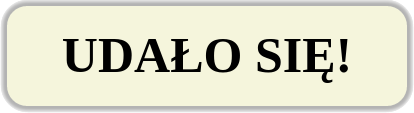

# Border and box shadow

### Exercise 1
Create a **div** with the ```popup``` class. Style the element to get the following look:



Styles:
* width: **400px**,
* height: **100px**,
* background color: **beige**,
* shadow - centered, **5px** blur, **5px** shadow width, color **rgba(0,0,0,0.3)**,
* horizontally centered text, font size **50px**, moved **20px** from the top, font weight **700**,
* rounding corners: **20px**.


### Exercise 2
In the HTML file create 3 **div** elements in the following way:
* The first one with the ```ellipse``` class - in the style.css set:
  * width: 180px,
  * height: 100px,
  * background color: lime,
  * to round the corners use the shortened version of border-radius, use % unit,

* The second one with the ```circle``` class - ustaw mu w pliku style.css:
  * width: 100px,
  * height: 100px,
  * background color: lime,
  * to round the corners use the shortened version of border-radius, use % unit,

* The third one with the ```lime``` class - ustaw mu w pliku style.css:
  * width: 100px,
  * height: 100px,
  * background color: lime,
  * to round the corners use the shortened version of border-radius, use % unit.

Styled elements should look like in the picture below:

|ellipse|circle|lime|
|:--:|:--:|:--:|
|  |  |	 |
