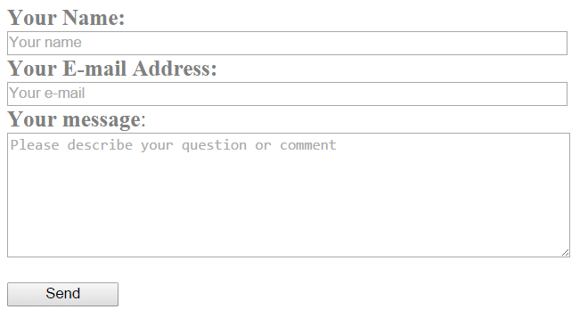
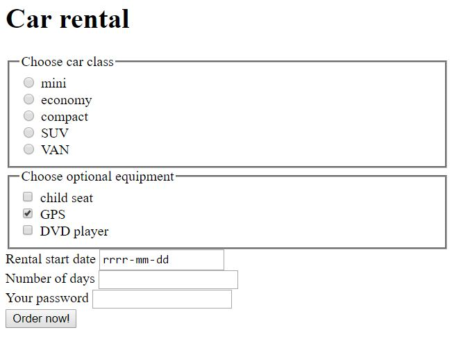

# HTML/CSS &ndash; forms

### Guidelines
* The first form should have the ```contactForm``` class, and the second - ```rentCarForm```.
* Select the type of input that is most appropriate in a given place. One type is needed where the user enters an email address, another when giving the date, and a different one for the password, etc.
* A label should be associated with its input.
* Note that one of the checkboxes is selected by default.
* Check the documentation, in **radio** and **checkbox** input pay extra attention to the **name** attributes.
* What are those frames visible in form 2? The answer is connected with **fieldset**.
* Do not pay attention to the style of the form. Concentrate on writing HTML code well.


1. Create a contact form as shown below:

  

2. Create a car rental form according to the example below:

  


## Need help or inspiration?
* [Labels and inputs](https://developer.mozilla.org/en-US/docs/Web/HTML/Element/label)
* [Documentation, ogólnie o formularzach](https://developer.mozilla.org/en-US/docs/Web/HTML/Element/form)
* [Documentation, checkbox](https://developer.mozilla.org/en-US/docs/Web/HTML/Element/input/checkbox)
* [Documentation, radio](https://developer.mozilla.org/en-US/docs/Web/HTML/Element/input/radio)
* [What is fieldset?](https://developer.mozilla.org/en-US/docs/Web/HTML/Element/label)
* HTML and CSS &ndash; prework;
